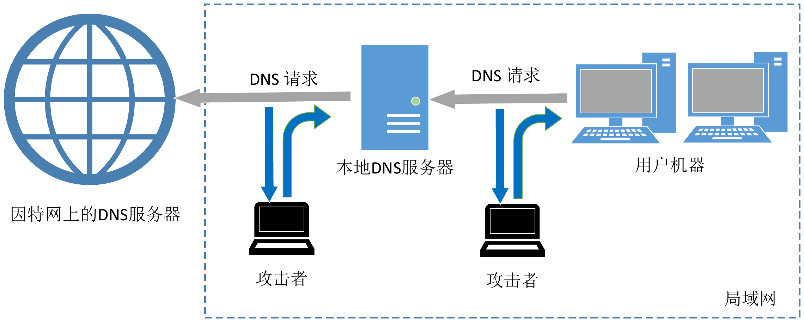

[我的课程](http://10.203.14.25/my/courses.php)[DNS 攻击实验 - 远程攻击](http://10.203.14.25/course/view.php?id=28)

# DNS 攻击实验 - 远程攻击

[课程](http://10.203.14.25/course/view.php?id=28)[成绩](http://10.203.14.25/grade/report/index.php?id=28)[活动](http://10.203.14.25/course/overview.php?id=28)[能力](http://10.203.14.25/admin/tool/lp/coursecompetencies.php?courseid=28)[更多](http://10.203.14.25/course/view.php?id=28#)


## 章节大纲

- 

  ### [概述](http://10.203.14.25/course/section.php?id=152)

  [全部折叠](http://10.203.14.25/course/view.php?id=28#)

  本实验的目的是让大家掌握远程 DNS 缓存中毒攻击 (也被称为 Kaminsky DNS 攻击) 的经验，DNS (Domain Name System) 是互联网的电话本，它可以帮助用户通过主机名找到 IP 地址，或者反向查询。这种查询的过程是比较复杂的，DNS攻击便是针对于这一过程，以各种方式将用户误导至攻击者提供的 IP 地址 (该IP往往是恶意的)。本实验关注于一种叫做 DNS 缓存中毒攻击的攻击技术。在另一个 SEED 实验中，我们设计了一个在本地网络环境下的 DNS 缓存中毒攻击实验，即攻击者和受害的 DNS 服务器位于同一网络中。在这种情况下，攻击者可以使用数据包嗅探的技术。而在远程攻击中，没法用数据包嗅探，因此远程 DNS 攻击变得更有挑战和难度。本实验涵盖以下主题：

  - DNS 介绍与 DNS 工作原理
  - DNS 服务器搭建
  - DNS 缓存中毒攻击
  - 伪造 DNS 响应
  - 数据包伪造

- 

  ### [实验环境搭建（任务 1）](http://10.203.14.25/course/section.php?id=155)

  DNS缓存中毒攻击的主要目标是本地 DNS 服务器。显然，攻击真实的 DNS 服务器是违法的，因此我们需要搭建自己的 DNS 服务器来进行攻击实验。实验环境需要四台独立的机器：一台用于模拟受害者，一台用作 DNS 服务器，两台用于攻击者。下图描述了实验环境的设置。

   

  

  

  为了简单起见，我们将这些 VM 都放在同一 LAN (局域网)中，但学生不可以在攻击中利用这一点，他们应该将攻击者的机器视为远程机器，即攻击者无法在 LAN 上嗅探数据包。这与本地DNS攻击有所不同。

   

  本实验在 SEEDUbuntu20.04 VM 中测试可行。你可以登录虚拟机平台用我们预先构建好的 SEEDUbuntu20.04 VM 来进行实验。

   

  你也可以在其他 VM、物理机器以及云端 VM 上自行配置环境进行实验，但我们不保证实验能在其他 VM 下成功。实验所需的文件可从下方下载，解压后会得到一个名为 Labsetup 的文件夹，该文件夹内包含了完成本实验所需的所有文件。

  - 

    [Labsetup_DNS_Remote.zip 文件](http://10.203.14.25/mod/resource/view.php?id=505)ZIP

  - 

    [Labsetup_DNS_Remote_ARM.zip 文件](http://10.203.14.25/mod/resource/view.php?id=504)ZIP

  - - 

      #### [容器配置和命令](http://10.203.14.25/course/section.php?id=642)

      解压 Labsetup 压缩包， 进入 Labsetup 文件夹，然后用 docker-compose.yml 文件安装实验环境。 对这个文件及其包含的所有 Dockerfile 文件中的内容的详细解释都可以在[用户手册](https://github.com/seed-labs/seed-labs/blob/master/manuals/docker/SEEDManual-Container.md)（注意：如果你在部署容器的过程中发现从官方源下载容器镜像非常慢，可以参考手册中的说明使用当地的镜像服务器）中找到。 如果这是你第一次使用容器设置 SEED 实验环境，那么阅读用户手册非常重要。

      在下面，我们列出了一些与 Docker 和 Compose 相关的常用命令。 由于我们将非常频繁地使用这些命令，因此我们在 .bashrc 文件 （在我们提供的 SEED Ubuntu 20.04 虚拟机中）中为它们创建了别名。

      

      ```markup
      $ docker-compose build  # 建立容器镜像
      $ docker-compose up     # 启动容器
      $ docker-compose down   # 关闭容器
      
      // 上述 Compose 命令的别名
      $ dcbuild       # docker-compose build 的别名
      $ dcup          # docker-compose up 的别名
      $ dcdown        # docker-compose down 的别名
      ```

      所有容器都在后台运行。 要在容器上运行命令，我们通常需要获得容器里的 Shell 。 首先需要使用 docker ps 命令找出容器的 ID ， 然后使用 docker exec 在该容器上启动 Shell 。 我们已经在 .bashrc 文件中为这两个命令创建了别名。

      ```markup
      $ dockps        // docker ps --format "{{.ID}}  {{.Names}}" 的别名
      $ docksh <id>   // docker exec -it <id> /bin/bash 的别名
      
      // 下面的例子展示了如何在主机 C 内部得到 Shell
      $ dockps
      b1004832e275  hostA-10.9.0.5
      0af4ea7a3e2e  hostB-10.9.0.6
      9652715c8e0a  hostC-10.9.0.7
      
      $ docksh 96
      root@9652715c8e0a:/#
      
      // 注: 如果一条 docker 命令需要容器 ID，你不需要
      //     输入整个 ID 字符串。只要它们在所有容器当中
      //     是独一无二的，那只输入前几个字符就足够了。
      ```

      如果你在设置实验环境时遇到问题，可以尝试从手册的“Miscellaneous Problems”部分中寻找解决方案。

  - - 

      #### [关于攻击者容器](http://10.203.14.25/course/section.php?id=643)

      在本实验中，我们可以使用虚拟机或攻击者容器作为攻击机器。如果你查看 Docker Compose 文件，你会看到攻击者容器的配置与其他容器不同。以下是这些差异：

       

      • 共享文件夹。当我们使用攻击者容器执行攻击时，需要将攻击代码放在攻击者容器内部。在虚拟机中进行代码编辑比在容器中更为方便，因为我们可以使用我们喜欢的编辑器。为了使虚拟机和容器共享文件，我们使用 Docker volumes 在虚拟机和容器之间创建了一个共享文件夹。如果你查看 Docker Compose 文件，就会发现我们已经在某些容器中添加了以下条目。它表示将主机（即 VM）上的 ./volumes 文件夹挂载到容器内的 /volumes 文件夹。我们在虚拟机上将代码写入 ./volumes 文件夹，就可以在容器内使用它们。

       

      ```markup
      volumes:
          - ./volumes:/volumes
      ```

       

      • 主机模式。在本实验中，攻击者需要能够嗅探数据包。但在容器内运行嗅探程序存在问题，因为每个容器实际上是连接到一个虚拟交换机上，所以它只能看到自己的流量，而无法看到其他容器间的数据包。为了解决这个问题，我们将攻击者容器的网络模式设置为 host 模式，这允许攻击者容器看到所有的流量。以下是用于配置攻击者容器的条目:

       

      ```markup
      network_mode: host
      ```

       

      当容器的网络处于 host 模式, 它可以看到主机的所有网络接口，且甚至拥有与主机相同的 IP 地址。它大体上与主机处于同一网络命名空间。然而，这个容器仍然是一台独立的机器，因为其他命名空间与主机不同。

  - - 

      #### [DNS 配置总结](http://10.203.14.25/course/section.php?id=644)

      所有容器已经为本实验配置好了。我们在这里提供一个总结，以便大家了解这些配置。配置的详细说明可以在手册中找到。

      **本地 DNS 服务器** 我们在本地 DNS 服务器上运行 BIND 9 DNS 服务器程序。BIND 9 的配置放在 /etc/bind/named.conf 的文件中。这个文件是主配置文件，它通常包含几个 "include" 条目，实际的配置存储在这些被 include 的文件中。其中一个文件为 /etc/bind/named.conf.options。主要的配置就在这个文件里。

      - *简化。* DNS 服务器现在会随机化它们 DNS 查询的源端口号；这使得攻击变得更加困难。遗憾的是，许多 DNS 服务器仍然使用可预测的源端口号。为了简化本实验，我们在配置文件中将源端口号固定为 33333。
      - *关闭 DNSSEC。* DNSSEC 是为防止对 DNS 服务器的攻击而引入的安全机制。为了展示攻击在没有这种保护机制下是如何工作的，我们在配置文件中关闭了这个保护机制。
      - *DNS 缓存。* 在攻击过程中，我们需要检查本地 DNS 服务器的 DNS 缓存。以下两个命令与 DNS 缓存相关。第一个命令将缓存内容转储到文件 /var/cache/bind/dump.db 中，第二个命令则清空缓存。

      ```markup
      # rndc dumpdb -cache    // 将缓存转储到指定文件
      # rndc flush            // 清空 DNS 缓存
      ```

      - *转发* *attacker32.com* *区域。* 我们在本地 DNS 服务器中添加了一个转发区域，目的是为了当有人查询 attacker32.com 域名时，查询会被转发到运行在攻击者容器（10.9.0.153）中的域名服务器。这个转发区域设置在 named.conf 文件中。

      ```markup
      zone "attacker32.com" {
          type forward;
          forwarders { 
              10.9.0.153; 
          };
      };
      ```

      **用户机器** 10.9.0.53 已经设置成用户容器 10.9.0.5 的本地 DNS 服务器，这是通过修改用户机器的 /etc/resolv.conf 来实现的。服务器 10.9.0.53 被添加为文件中的第一个 nameserver 条目，所以该服务器将作为首选 DNS 服务器。

      **攻击者的域名服务器** 在攻击者的域名服务器上，我们托管了两个区域。一个是攻击者的合法区域 attacker32.com，另一个是伪造的 example.com 区域。区域的配置在 /etc/bind/named.conf 文件中：

      ```markup
      zone "attacker32.com" {
              type master;
              file "/etc/bind/attacker32.com.zone";
      };
      
      zone "example.com" {
              type master;
              file "/etc/bind/example.com.zone";
      };
      ```

  - - 

      #### [DNS 配置测试](http://10.203.14.25/course/section.php?id=645)

      在用户容器中，我们将运行一系列命令来确保我们的实验设置正确。在实验报告中，请记录你的测试结果。

      **获取** **ns.attacker32.com** **的 IP 地址** 当我们运行以下 dig 命令时，本地 DNS 服务器将根据添加到其配置文件中的 forward 区域条目，将请求转发到攻击者的域名服务器。因此，回复应来自我们在攻击者域名服务器上设置的区域文件（attacker32.com.zone）。如果得到的结果不是这样，那么你的设置可能存在问题。请在实验报告中描述观察结果。

      ```markup
      $ dig ns.attacker32.com
      ```

      **获取** **www.example.com** **的 IP 地址** 现在有两个域名服务器托管 example.com 域名，一个是该域的官方域名服务器，另一个是攻击者容器。我们将查询这两个域名服务器，看看得到什么响应。请运行以下两个命令（从用户机器上运行），并描述观察结果。

      ```markup
      // 将查询发送到我们的本地 DNS 服务器，本地服务器会将查询
      // 转发到 example.com 的官方名称服务器。
      $ dig www.example.com
      
      // 直接向 ns.attacker32.com 查询
      $ dig @ns.attacker32.com www.example.com
      ```

      显然，没有人会向 ns.attacker32.com 查询 www.example.com 的 IP 地址；他们总是会向 example.com 的官方域名服务器查询答案。DNS 缓存投毒攻击的目标是让受害者向 ns.attacker32.com 查询 www.example.com 的 IP 地址。换句话说，如果我们的攻击成功，只要运行第一个 dig 命令（没有 @ 选项的那个），我们就会从攻击者那里得到伪造的结果，而不是从官方的域名服务器获取的真实结果。

- 

  ### [攻击任务](http://10.203.14.25/course/section.php?id=646)

  DNS攻击的主要目的是在用户使用 A 的域名前往 A 主机时，将用户导向到另一个主机 B。例如，假设 www.example.com 是一个在线银行网站，当用户尝试使用正确的 URL www.example.com 访问该网站时，如果攻击者可以将用户重定向到一个非常类似于 www.example.com 的恶意站点，那么用户很有可能被欺骗并向攻击者泄露自己的用户名和密码信息。

  在此任务中，我们将域名 www.example.com 作为我们的攻击目标。需要注意的是，example.com 是一个保留域名，并不用作任何真实用途，所以我们可以放心使用。www.example.com 的真实IP地址为 93.184.216.34， 它的域名服务器由 Internet Corporation for Assigned Names and Numbers (ICANN) 管理。当用户用 dig 命令查询www.example.com 的 IP 地址时，或在浏览器中输入该域名时，用户主机会向本地 DNS 服务器发送 DNS 查询请求，该 DNS 服务器最终将从 example.com 的域名服务器中得到 IP 地址。

  攻击的目标是对本地 DNS 服务器进行 DNS 缓存投毒攻击，使得当用户运行 dig 命令来查找 www.example.com 的 IP 地址时，本地 DNS 服务器会从攻击者的域名服务器ns.attacker32.com 获得 IP 地址，因此返回的 IP 地址是攻击者提供的。导致的结果是用户会被导向攻击者的恶意站点，而不是真实的 www.example.com。

  

  - - 

      #### [Kaminsky 攻击原理](http://10.203.14.25/course/section.php?id=647)

      在此任务中，攻击者向受害 DNS 服务器 (Apollo) 发送 DNS 查询请求，从而触发来自 Apollo 的 DNS 查询。DNS 查询首先前往其中一个根 DNS 服务器，接着是 .COM 的 DNS服务器，最终从 example.com 的 DNS 服务器得到查询结果，查询过程如上图所示。如果 example.com 的域名服务器信息已经被 Apollo 缓存，那么查询不会前往根服务器或 .COM DNS 服务器，这个过程如下图所示。在本实验中，下图描绘的场景更为常见，因此我们以这个图为基础来描述攻击机制。

      

      当 Apollo 等待来自 example.com 域名服务器的DNS答复时，攻击者可以发送伪造的答复给 Apollo，假装这个答复是来自 example.com 的域名服务器。如果伪造的答复先到达而且有效，那么它将被 Apollo 接收，攻击成功。

      

      如果你已经做了本地 DNS 攻击的实验，你应该会知道那个实验的攻击是假定攻击者和DNS服务器位于同一局域网，所以攻击者可以捕捉到DNS查询数据包。但当攻击者与DNS服务器不在同一局域网时，缓存投毒攻击会变得非常困难。主要的难点在于DNS响应中的 Transcation ID 必须与查询请求中的相匹配。由于查询中的 ID 通常是随机生成的，在看不到请求包的情况下，攻击者很难猜到正确的ID。

      

      当然，攻击者可以猜测 Transcation ID。由于这个 ID 只有16 个比特大小，如果攻击者可以在攻击窗口内伪造 K 个响应 (即在合法响应到达之前)，那么攻击成功的可能性就是 K/216。发送数百个伪造响应并不是不切实际的，因此攻击成功是比较容易的。

      

      然而，上述假设的攻击忽略了 DNS 缓存。在现实中，如果攻击者没有在合法的响应到达之前猜中正确的 Transcation ID，那么DNS服务器会将正确的信息缓存一段时间。这种缓存效果使攻击者无法继续伪造针对该域名的响应，因为 DNS 服务器在缓存超时之前不会针对该域名发出另一个DNS查询请求。为了继续对同一个域名的响应做伪造，攻击者必须等待针对该域名的另一个DNS查询请求，这意味着他必须要等到缓存超时，而等待时间会长达几小时甚至是几天。

      Dan Kaminsky 提出了一个巧妙的方法来解决缓存的问题。通过他的方案，攻击者可以持续地发起欺骗攻击，而不需要等待，因此攻击可以在很短的一段时间内成功。攻击的详细描述在书中可以找到。在本任务中，我们将尝试这个攻击手段。以下步骤（基于上图）概述了攻击的过程。

      

      1. 攻击者向DNS服务器Apollo 查询example.com域中一个不存在的主机名，如twysw.example.com，其中twysw是一个随机的名字。
      2. 由于Apollo的DNS缓存中不会有这个主机名，Apollo 会向example.com域的域名服务器发送一个DNS查询请求。
      3. 当Apollo 等待答复时，攻击者向 Apollo发送大量的伪造的DNS响应，每个响应尝试一个不同的 Transaction ID(期望其中一个是正确的)。在响应中，攻击者不仅提供twysw.example.com的IP 地址，还提供了一条``权威授权服务器’’记录，指明ns.attacker32.com是`example.com`域的域名服务器。如果伪造的响应比实际响应到达的早，且 Transaction ID 与请求中的 ID 一样，`Apollo`就会接受并缓存伪造的答案。这样`Apollo`的DNS缓存就被投毒成功了。
      4. 即使伪造的DNS响应失败了(例如，Transaction ID 不匹配或到达的太晚了)，也没有关系，因为下一次攻击者会查询另一个主机名，所以 Apollo 会发送另一个DNS请求，从而给攻击者提供了另一个伪造的机会。这种方法有效地克服了DNS缓存效果。
      5. 如果攻击成功，那么在Apollo的DNS缓存中，example.com域的域名服务器会被攻击者替换成ns.attacker32.com。为证明成功攻击，学生需要展示在Apollo的DNS缓存中存在这样一条记录。

      **任务综述** 实现Kaminsky攻击具有很强的挑战性，因此我们将它分解为好几个子任务。在任务2中，我们构造一个 example.com 域内主机名的DNS查询请求。在任务3中，我们构造一个从 example.com 域名服务器返回的伪造响应。在任务4中，我们前面的工作整合到一起，进行Kaminsky攻击。最后我们在任务5中验证攻击的效果。

  - - 

      #### [任务 2：构造 DNS 请求](http://10.203.14.25/course/section.php?id=648)

      任务2专注于发送DNS请求。为了完成攻击，攻击者需要触发目标DNS服务器发出DNS查询，这样攻击者才有机会去伪造DNS响应。由于攻击者需要尝试多次才能成功，因此最好使用程序来自动发送DNS查询。

      你需要编写一个程序来向目标服务器发送DNS请求(即我们配置的本地DNS服务器)。具体任务是编写该程序并证明(使用Wireshark)他们的查询请求可以触发目标DNS服务器会发出相应的DNS查询。该任务对性能的要求不高，因此学生可以使用C语言或Python(使用Scapy)编写此代码。以下提供了Python的代码示例(你需要将其中的 +++ 替换为实际的值)。

      ```python
      Qdsec  = DNSQR(qname='www.example.com')
      dns    = DNS(id=0xAAAA, qr=0, qdcount=1, ancount=0, nscount=0,
                   arcount=0, qd=Qdsec)
      
      ip  = IP(dst='+++', src='+++')
      udp = UDP(dport=+++, sport=+++, chksum=0)
      request = ip/udp/dns
      ```

  - - 

      #### [任务 3: 伪造 DNS 响应](http://10.203.14.25/course/section.php?id=649)

      在此任务中，我们需要伪造Kaminsky攻击中的DNS响应。由于我们的攻击目标是 example.com，我们需要伪造从该域的域名服务器返回的响应。你首先需要找到 example.com 的合法域名服务器的IP地址(值得注意的是这个域名有多个域名服务器)。

      你可以使用Scapy来实现这个任务，以下的代码示例构建了一个DNS响应包，其中包含了问题部分，回答部分以及一个域名服务器部分。在这段代码中，我们使用 +++ 作为占位符，你需要用Kaminsky攻击中所需要的值来替换。你需要解释为什么选择这些值。

      ```python
      name   = '+++'  
      domain = '+++'  
      ns     = '+++'
      
      Qdsec  = DNSQR(qname=name)
      Anssec = DNSRR(rrname=name,   type='A',  rdata='1.2.3.4', ttl=259200)
      NSsec  = DNSRR(rrname=domain, type='NS', rdata=ns, ttl=259200)
      dns    = DNS(id=0xAAAA, aa=1, rd=1, qr=1,
                   qdcount=1, ancount=1, nscount=1, arcount=0,
                   qd=Qdsec, an=Anssec, ns=NSsec)
      
      ip    = IP(dst='+++', src='+++')
      udp   = UDP(dport=+++, sport=+++, chksum=0)
      reply = ip/udp/dns
      ```

      由于这些响应本身并不能成功实施攻击，为了展示任务完成的效果，你需要使用Wireshark来捕获伪造的DNS响应，并证明这些伪造的数据包是合法的。

  - - 

      #### [任务 4：进行 Kaminsky 攻击](http://10.203.14.25/course/section.php?id=650)

      现在我们将所有东西合在一起进行 Kaminsky 攻击。在攻击中，我们需要发送许多欺骗的 DNS 响应，希望其中有一个可以猜中正确的 Transaction ID，并比合法的响应更早到达。因此，发包速度至关重要：发出的数据包越多，成功的概率也就越大。如果我们像之前的任务那样，使用 Scapy 发送伪造的 DNS 回复成功率会非常低。学生可以使用 C 语言进行实现，但在 C 语言中构造 DNS 数据包并非易事。因此我们采用一个使用 C 语言和 Scapy 相结合的混合方法。通过混合方法，我们首先使用 Scapy 生成 DNS 数据包模板，并把模板保存在文件中。接着我们将该数据包模板加载到 C 程序中，并对其中某些字段进行一些微小修改，然后发出这个数据包。我们在 Labsetup/Files/attack.c 中提供了 C 语言的代码框架。学生可以对其中标记的区域进行修改，详细的代码解释在之后的指南部分中。

       

      **检查 DNS 缓存** 为了检查攻击是否成功，我们需要查看 DNS 缓存。以下的命令先将 DNS 缓存存到文件中，然后在文件中搜寻 attacker 关键词 (在我们的攻击中，我们采用 attacker32.com 作为攻击者的域名，如果学生使用不同的攻击域名，那么需要搜索不同的关键词)。

      ```markup
      # rndc dumpdb -cache && grep attacker /var/cache/bind/dump.db
      ```

  - - 

      #### [任务 5：攻击结果验证](http://10.203.14.25/course/section.php?id=651)

      如果攻击成功，在本地 DNS 服务器的缓存中，example.com 的 NS 记录应该会改为 ns.attacker32.com。当服务器收到对 example.com 域内的任何域名的查询请求时，它会向 ns.attacker32.com 发送查询请求，而不是向原本合法的域名服务器。

       

      为了验证攻击是否成功，在用户主机上运行以下两条 dig 命令。在两次响应中，www.example.com 的 IP 地址应该相同，并且应该是在攻击主机的区域文件中配置的内容。

      ```markup
      //向本地 DNS 服务器发出查询请求
      $ dig www.example.com
      
      //直接向 attacker32 域名服务器发出请求
      $ dig @ns.attacker32.com www.example.com
      ```

       

      请在实验报告中给出你的观察结果 (截图)，并解释你认为攻击成功的原因。需要注意的是，当你第一次运行 dig 命令时，请使用 Wireshark 来捕获网络流量，并指出 dig 命令触发了哪些数据包。根据数据包追踪来证明你的攻击是成功的。请注意，在运行第一个 dig 命令后，DNS 结果可能会缓存在本地 DNS 服务器上。如果你在使用 Wireshark 之前运行了第一个 dig 命令，这可能会影响结果。你可以在本地 DNS 服务器上使用 "sudo rndc flush" 清除缓存，但这将需要你重新进行攻击。

- 

  ### [指南](http://10.203.14.25/course/section.php?id=652)

  为了实现Kaminsky攻击，我们使用Scapy进行数据包伪造。但Python每秒生成的数据包太少以至于攻击很难成功。所以最好的方法是使用C语言程序，然而这对于许多学生来说颇具挑战，因为用C语言构造DNS数据包并非易事。我们开发了一种混合方法，并在课堂上进行了实验。通过这种方法，可以大大减少学生在编程上花费的时间，因此他们可以将更多的时间用于关注攻击本身。

  这个方法是同时利用Scapy和C的优势：Scapy在构建DNS数据包方面远远的比C更方便，但是C速度更快。因此我们使用Scapy构建伪造的DNS数据包，并将它保存到文件中，接着我们将数据包加载到C程序中。尽管在Kaminsky攻击过程中，我们需要发送许多不同的DNS数据包，但除了少数字段外，这些数据包几乎相同。我们可以将Scapy生成的数据包作为基础，找到需要修改地方的偏移量(如 Transaction ID 字段)，直接进行修改。这比在C中创建整个DNS数据包要简单很多。进行修改之后，我们使用原始的套接字发送这些数据包。有关这种混合方法的详细信息，请参见SEED书中《数据包嗅探和伪造》一章。以下的Scapy程序会创建一个简单的DNS响应数据包并将其保存在文件中。

  ```python
  #!/usr/bin/env python3
  from scapy.all import *
    
  # Construct the DNS header and payload
  name   = 'twysw.example.com'
  Qdsec  = DNSQR(qname=name)
  Anssec = DNSRR(rrname=name, type='A', rdata='1.1.2.2', ttl=259200)
  dns    = DNS(id=0xAAAA, aa=1, rd=0, qr=1, 
                 qdcount=1, ancount=1, nscount=0, arcount=0, 
                 qd=Qdsec, an=Anssec)
    
  # Construct the IP, UDP headers, and the entire packet
  ip  = IP(dst='10.0.2.7', src='1.2.3.4', chksum=0)
  udp = UDP(dport=33333, sport=53, chksum=0)
  pkt = ip/udp/dns
    
  # Save the packet to a file
  with open('ip.bin', 'wb') as f:
    f.write(bytes(pkt))
  ```

  在C程序中，我们从文件ip.bin中读入数据包，并将其用作数据包的模板，在此模板上，我们可以创建许多类似的数据包，并向本地DNS服务器发送这些伪造的相应数据包。对于每个响应，我们修改三个地方：Transaction ID 和在两个位置(查询字段和应答字段)出现的twysw。Transaction ID在一个固定的位置(从IP数据包开头偏移量28)，但名称twysw的偏移位置取决于域名的长度。我们可以使用二进制编辑器，如ghex，来查看二进制文件ip.bin并找到twysw的两个偏移量。在我们的数据包中，他们的偏移量是41 和 64。

  以下的代码片段显示了我们如何修改这些字段。我们将响应中的域名改为bbbbb.example.com，并发出一个伪造的DNS答复(Transaction ID 为1000)。在代码中，变量ip指向IP数据包的起始点。

  ```c
    // 修改查询字段中的域名 (offset=41)
    memcpy(ip+41, "bbbbb" , 5);
  
    // 修改答案字段中的域名 (offset=64)
    memcpy(ip+64, "bbbbb" , 5);
  
    // 修改 Transaction ID 字段 (offset=28)
    unsigned short id = 1000;
    unsigned short id_net_order = htons(id);
    memcpy(ip+28, &id_net_order, 2);
  ```

  **生成随机子域名** 在 Kaminsky 攻击中，我们需要生成随机的子域名。有许多方法可以做到这一点。以下的代码片段展示了如何生成一个5个字符的随机子域名。

  ```c
  char a[26]="abcdefghijklmnopqrstuvwxyz";
    
  // 生成长度为5的随机名称
  char name[6];
  name[5] = 0;
  for (int k=0; k<5; k++)  
     name[k] = a[rand() % 26];
  ```

  **编译程序** 我们可以运行以下命令来编译程序：

  ```markup
  $ gcc -o attack attack.c
    
  // Apple 机型请使用静态绑定：
  $ gcc -static -o attack attack.c
  ```

- 

  ### [提交](http://10.203.14.25/course/section.php?id=160)

  你需要在“学在浙大”提交一份带有截图的详细实验报告来描述你所做的工作和你观察到的现象。你还需要对一些有趣或令人惊讶的观察结果进行解释。请同时列出重要的代码段并附上解释。只是简单地附上代码不加以解释不会获得分数。
